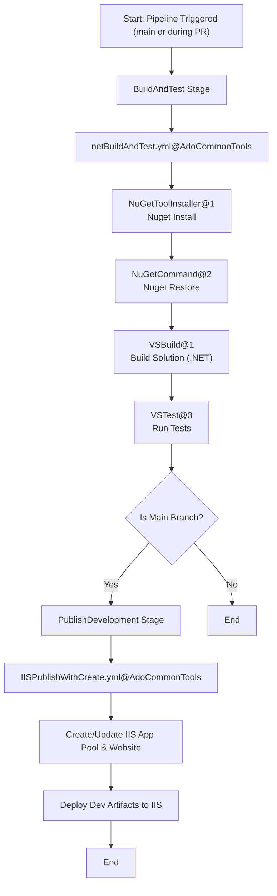

# Flow Chart of the .Net to IIS example

```mermaid
flowchart TD
    A["Start: Pipeline Triggered (main or during PR)"] --> B["BuildAndTest Stage"]
    B --> C["netBuildAndTest.yml@AdoCommonTools"]
    C --> D["NuGetToolInstaller@1\nNuget Install"]
    D --> E["NuGetCommand@2\nNuget Restore"]
    E --> F["VSBuild@1\nBuild Solution (.NET)"]
    F --> G["VSTest@3\nRun Tests"]
    G --> H{Is Main Branch?}
    H -- Yes --> I["PublishDevelopment Stage"]
    H -- No --> Z["End"]
    I --> J["IISPublishWithCreate.yml@AdoCommonTools"]
    J --> K["Create/Update IIS App Pool & Website"]
    K --> L["Deploy Dev Artifacts to IIS"]
    L --> M["End"]
```