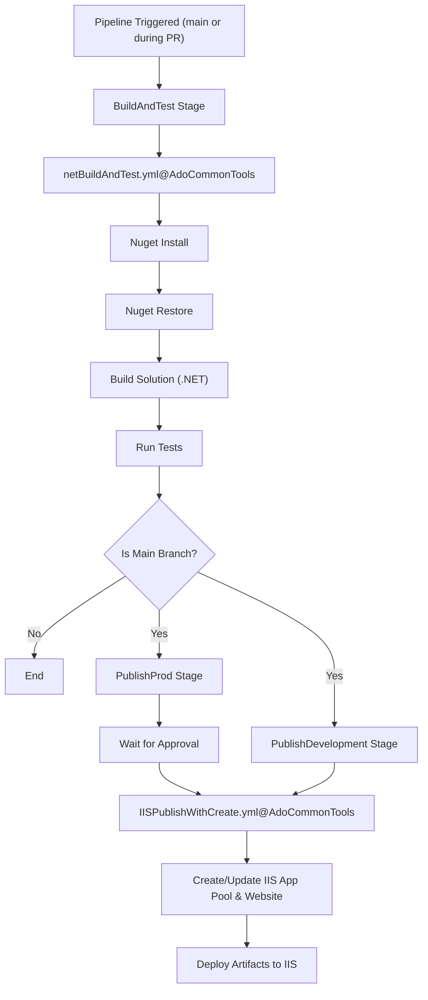

You can convert this to draw.io, see https://www.drawio.com/blog/mermaid-diagrams

```mermaid
flowchart TD
    Trigger["Pipeline Triggered (main or during PR)"] --> BuildTest["BuildAndTest Stage"]
    BuildTest --> CommonBuildTest["netBuildAndTest.yml@AdoCommonTools"]
    CommonBuildTest --> NugetInstall["Nuget Install"]
    NugetInstall --> NugetRestore["Nuget Restore"]
    NugetRestore --> DotNetBuild["Build Solution (.NET)"]
    DotNetBuild --> RunTests["Run Tests"]
    RunTests --> IsMain{"Is Main Branch?"}
    IsMain -- No --> End["End"]
    IsMain -- Yes --> PublishDev["PublishDevelopment Stage"]
    IsMain -- Yes --> PublishProd["PublishProd Stage"]
    PublishProd --> Approval["Wait for Approval"]
    Approval --> IISPublish

    PublishDev --> IISPublish["IISPublishWithCreate.yml@AdoCommonTools"]
    IISPublish --> ConfigIIS["Create/Update IIS App Pool & Website"]
    ConfigIIS --> DeployDev["Deploy Artifacts to IIS"]
```
